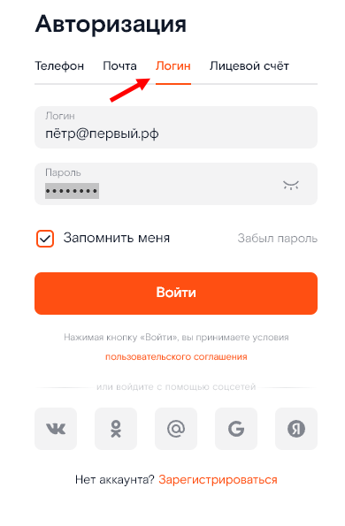
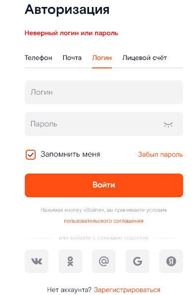
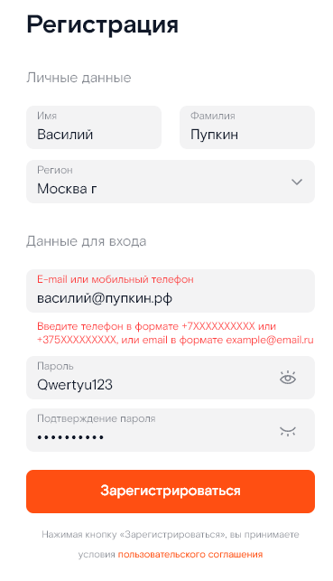
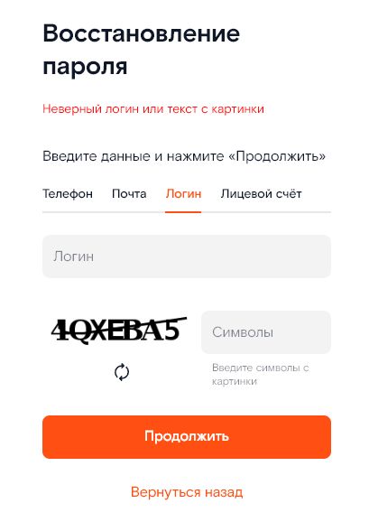

# Отчёт об ошибках

## Ошибка 1. Расположение элементов на странице авторизации не соответствует требованиям.
В [требованиях](SSO%20Requirements.doc) заявлено:

> 2. В левой части:
> 
>   a. Меню выбора типа аутентификации
> 
>   i. Таб выбора аутентификации по номеру, "Номер"
> 
>   ii. Таб выбора аутентификации по логину и паролю, "Почта"
> 
>   iii. Таб выбора аутентификации по почте и паролю, "Логин"
> 
>   iv. Таб выбора аутентификации по лицевому счету и паролю, “Лицевой счет”
> 
>   b. Форма ввода "Номер" или "Логин" или "Почта" или “Лицевой счет” (По умолчанию выбрана форма авторизации по телефону)
> 
>   c. Форма ввода "Пароль"
> 
> 3. В правой части:
> 
>   a. Продуктовый слоган ЛК "Ростелеком ID".
> 
>   b. Вспомогательная информация для клиента.

Продукт реализован фактически наоборот:

- в левой части логотип и продуктовый слоган ЛК "Ростелеком ID"
- в правой части - опции с типами аутентификации: "Номер", "Почта", "Логин" и "Лицевой счёт"
  и форма ввода логина и пароля, а также ссылки на формы регистрации и восстановления пароля 

## Ошибка 2. Неверные сообщения об ошибке и переключение на тип "логин" при вводе кириллицы в адрес электронной почты
### Ошибка 2-1. Неверное сообщение об ошибке и переключение на "логин" в форме авторизации

Шаги воспроизведения:

- Открыть форму авторизации
- Выбрать тип авторизации = "Почта"
- Ввести адрес почты (без кавычек) "пётр@исаев.рф"
- Ввести произвольные латинские буквы и цифры в поле "Пароль"
- Нажать кнопку "Войти"

Ожидаемый результат: сообщение о неверном адресе электронной почты

Фактический результат:

- После введения адреса почты при переключении на поле "Пароль" меняется тип авторизации на "Логин"
- После отправки данных - сообщение о неверном _логине_ или пароле.

Скриншоты:

 

### Ошибка 2-2. Неверное сообщение об ошибке и переключение на поле "логин" в форме регистрации при вводе кириллицы

При попытке зарегистрировать нового пользователя с адресом почты из кириллицы, выводится сообщение об ошибке

Шаги воспроизведения:

- Открыть форму регистрации пользователя
- Заполнить корректными данными, ввести в поле адреса электронной почты значение (без кавычек) "василий@пупкин.рф"
- Нажать на кнопку "Зарегистрироваться"

**Ожидаемый результат**: данные формы отправляются, появляется экран с формой подтверждения адреса электронной почты

**Фактический результат**: под полем адреса почты высвечивается сообщение "Введите телефон в формате +7ХХХХХХХХХХ или
+375XXXXXXXXX, или email в формате example@email.ru". Форма не отправляется.

Скриншот:

### Ошибка 2-3. Неверное сообщение об ошибке при попытке восстановления пароля по адресу почты с русскими символами

Шаги воспроизведения:

- Открыть форму восстановления пароля
- Нажать опцию "Почта"
- Ввести в поле электронная почта значение (без кавычек) "василий@пупкин.рф"
- Ввести символы поля Captcha и нажать "Продолжить"

**Ожидаемый результат**: открыта форма восстановления пароля по адресу почты и сообщение, что адрес электронной почты
не зарегистрирован

**Фактический результат**: открыта форма восстановления пароля по _логину_ и сообщение "Неверный _логин_ или текст 
с картинки"

Скриншот:

